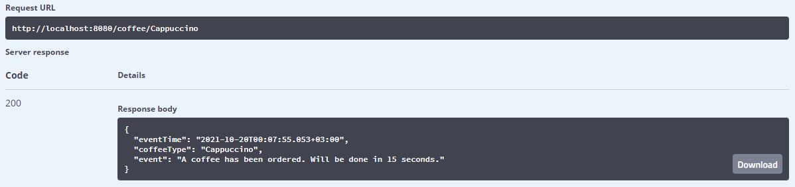
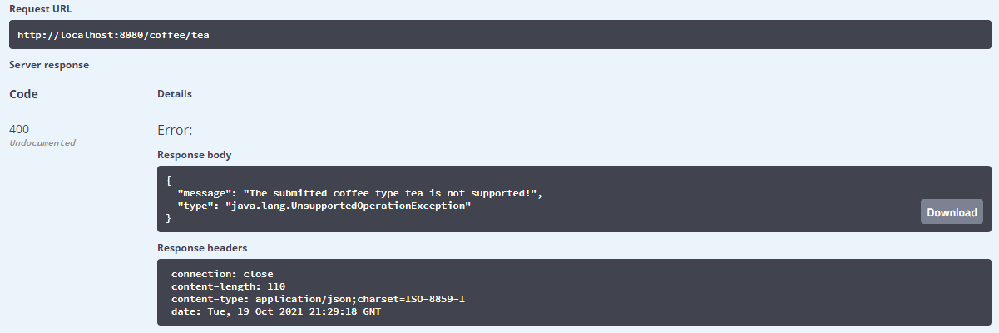
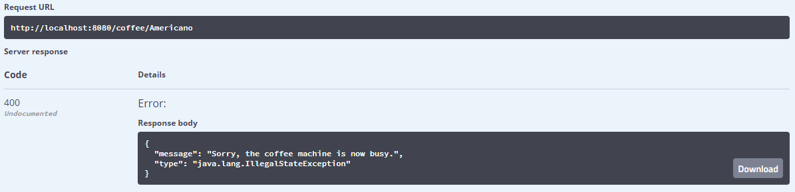
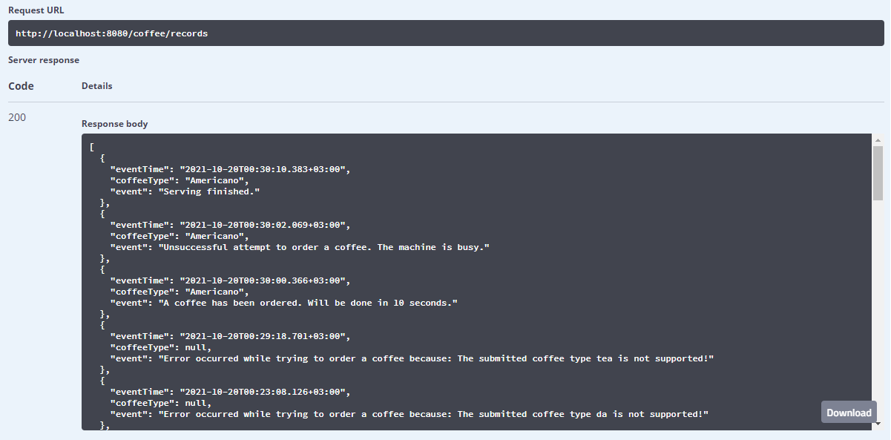

# Coffee machine

This is coffee machine application manipulated via a browser.

###Running the app

To start the application you need to run the `main` method in the `test_exercise.coffee.CoffeeApplication` class 
from the IDE.

Also, using the Spring Boot Maven plugin you can execute:
```shell
mvn spring-boot:run
``` 
###Swagger UI

To interact with the app via SwaggerUI pass to your browser `(root url)/swagger-ui.html`.

###Interaction

To order a coffee just specify the available coffee type.


If you try to order the coffee that is not supported by the machine you will get an error message.


Trying to order a coffee not waiting for the machine to finish its work will not succeed.


All the work of coffee machine is recorded, and you can watch all the records.
